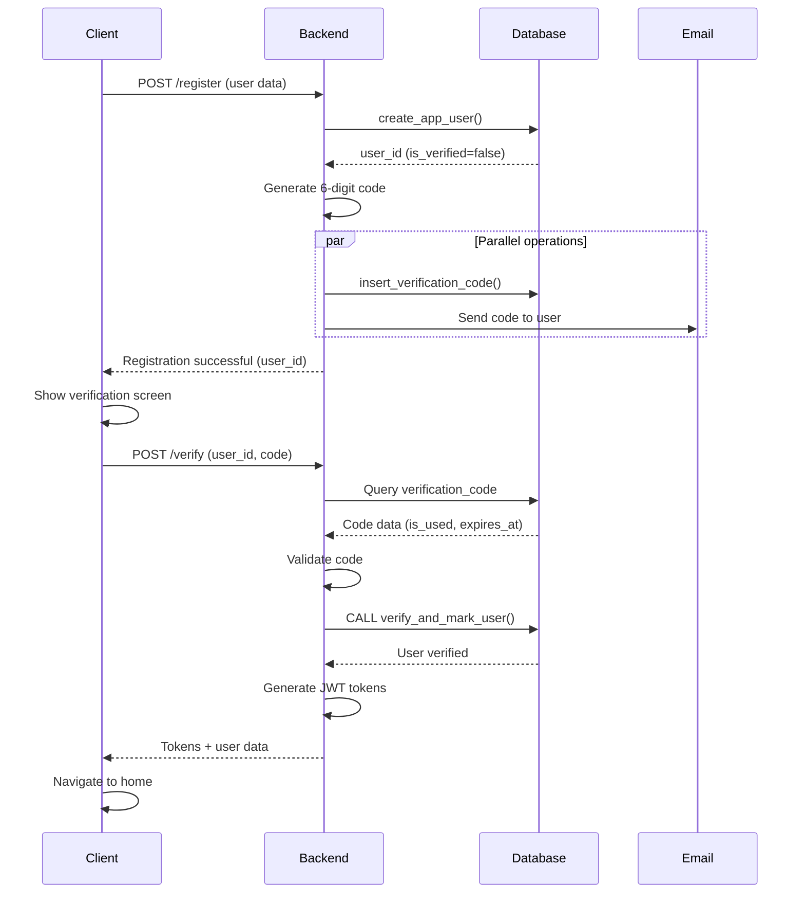

# Create User Flow

## Objective

Register new users in the marketplace system, automatically determining if they are natural persons or legal entities based on their document type. Includes email/phone verification process using time-limited verification codes.

## Business Rules

1. **User Type Determination**
   - Document type `V` (Venezolano) → Natural Person
   - Document type `J` (Jurídico) → Legal Entity (Company)

2. **Required Data**
   - **For all users:**
     - Email (unique)
     - Phone (unique, international format)
     - Password hash
     - Document type and number (unique)
     - Township (location)
   - **For Natural Persons (V):**
     - First name (required)
     - Surname (required)
     - Middle name (optional)
     - Second surname (optional)
     - Birthdate (optional)
   - **For Legal Entities (J):**
     - Company name (required)

3. **Default Values**
   - Role: Common user (role_id = 1)
   - Verified status: false (must verify via code)
   - Reputation level: New (reputation_level_id = 1)

4. **Verification Code Rules**
   - Codes are 6 digits long
   - Generated by backend and stored in database
   - Valid for 1 hour from creation
   - Only one active code per user per type (email/phone)
   - New code automatically invalidates previous unused codes
   - Once used, code cannot be reused
   - Email and phone verifications are independent

## Tables Involved

1. **`app_user`**: Core user authentication and authorization data
2. **`person`**: Natural person-specific data
3. **`company`**: Legal entity-specific data
4. **`verification_code`**: Email/phone verification codes
5. **`township`**: User location reference
6. **`role`**: User permission level
7. **`reputation_level`**: User reputation status

## Process Steps

### 1. Input Validation

```sql
IF document_type = 'J' AND company_name IS NULL THEN
    → Error: Company name required
END IF

IF document_type = 'V' AND (first_name IS NULL OR surname IS NULL) THEN
    → Error: First name and surname required
END IF
```

### 2. Create App User Record

```sql
INSERT INTO app_user (
    role_id,
    email,
    phone,
    password_hash,
    document_type,
    document_number,
    township_id
)
```

### 3. Create Type-Specific Record

**For Natural Persons:**

```sql
INSERT INTO person (
    app_user_id,
    first_name,
    middle_name,
    surname,
    second_surname,
    birthdate
)
```

**For Legal Entities:**

```sql
INSERT INTO company (
    app_user_id,
    company_name
)
```

### 4. Return User UUID

Function returns the `app_user_id` for use in subsequent operations.

### 5. Generate Verification Code (Backend)

After user creation, backend generates a 6-digit code and stores it:

```javascript
const code = Math.floor(100000 + Math.random() * 900000).toString();

await db.query("SELECT insert_verification_code($1, $2, $3)", [
  userId,
  code,
  "email",
]);

// Send code via email/SMS in parallel
await emailService.send(userEmail, code);
```

### 6. User Enters Code (Client)

User receives code and enters it in verification screen.

### 7. Validate and Verify User (Backend)

Backend validates code and marks user as verified:

```typescript
// 1. Query verification code
const result = await db.query(
  `
  SELECT verification_code_id, is_used, expires_at
  FROM verification_code
  WHERE app_user_id = $1 AND code = $2 
    AND verification_type = 'email'
`,
  [userId, code],
);

// 2. Backend validations
if (result.rows.length === 0) {
  return { error: "Invalid verification code" };
}

if (result.rows[0].is_used) {
  return { error: "Code already used" };
}

if (new Date(result.rows[0].expires_at) < new Date()) {
  return { error: "Code expired" };
}

// 3. Mark code as used and verify user
await db.query("CALL verify_and_mark_user($1, $2)", [
  result.rows[0].verification_code_id,
  userId,
]);

// 4. Generate authentication tokens
const accessToken = jwt.sign({ userId }, secret, { expiresIn: "15m" });
const refreshToken = jwt.sign({ userId }, refreshSecret, { expiresIn: "7d" });

return { success: true, accessToken, refreshToken };
```

### 8. User Authenticated

Client receives tokens and redirects to main application.

## Key Validations

1. **Uniqueness**: Email, phone, and document number must be unique
2. **Foreign Keys**: Role and township must exist
3. **Phone Format**: Must match international format `^\+[1-9][0-9]{7,14}$`
4. **Document Type**: Must be 'V' or 'J'
5. **Type-Specific Requirements**: Enforced based on document type

## Error Handling

| Error Type            | Cause                          | Message                                                                  |
| --------------------- | ------------------------------ | ------------------------------------------------------------------------ |
| Validation Error      | Missing required fields        | "Company name is required..." / "First name and surname are required..." |
| Unique Violation      | Duplicate email/phone/document | "User with this email, phone, or document number already exists"         |
| Foreign Key Violation | Invalid role_id or township_id | "Invalid reference: check role_id and township_id"                       |
| Invalid Code          | Wrong verification code        | "Invalid verification code"                                              |
| Code Already Used     | Code was already verified      | "Code already used"                                                      |
| Code Expired          | Code older than 1 hour         | "Code expired"                                                           |
| User Not Found        | Invalid app_user_id for code   | "User not found"                                                         |
| Other                 | Unexpected database error      | "Error creating user: [details]"                                         |

## Usage Examples

See [`tests/test_create_user.sql`](../tests/test_create_user.sql) for complete test cases.

## Related Functions

- `create_app_user()`: Creates new user account
- `insert_verification_code()`: Stores verification code generated by backend
- `verify_and_mark_user()`: Marks code as used and user as verified
- `update_timestamp()`: Automatically updates `updated_at` field

## Implementation Notes

1. **Transaction Safety**: Functions use implicit transactions, roll back on error
2. **Password Security**: Function expects pre-hashed password (argon2/bcrypt)
3. **Verification Logic in Backend**: Code validation is handled in backend, not database
4. **Code Expiration**: Codes expire after 1 hour (enforced via `expires_at` timestamp)
5. **Code Cleanup**: Expired codes should be deleted periodically via cron job
6. **Independent Verification Types**: Email and phone codes coexist independently
7. **Extensibility**: Easy to add more person/company fields as needed
8. **Atomic Operations**: User creation and verification are all-or-nothing across related tables

## Complete Registration Flow



## Security Considerations

1. **Rate Limiting**: Implement max 3 verification attempts per 15 minutes
2. **Code Generation**: Use cryptographically secure random number generator
3. **Token Storage**: Store refresh tokens in httpOnly cookies, not localStorage
4. **HTTPS Only**: All verification endpoints must use HTTPS
5. **Brute Force Protection**: Lock account after 5 failed verification attempts
6. **Code Reuse Prevention**: Codes are single-use only
7. **Time-based Expiration**: Codes automatically expire after 1 hour
